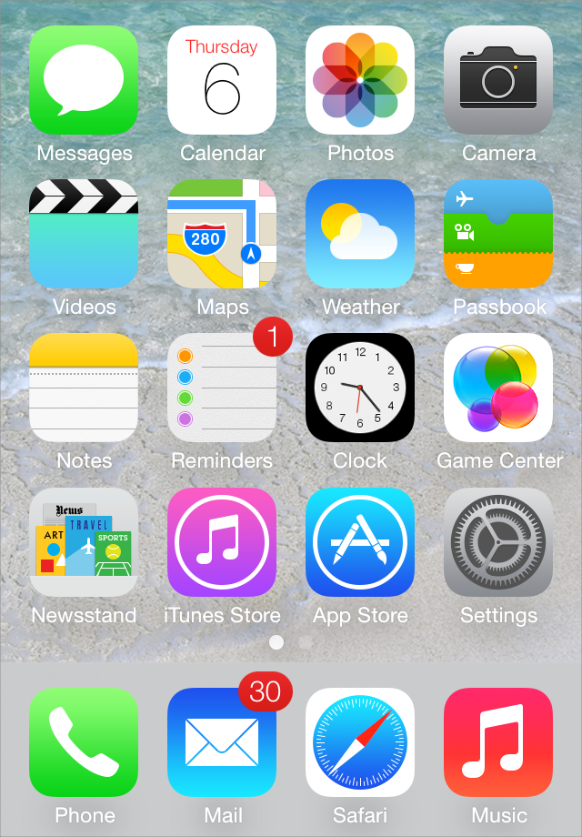

##App Icon
每一个应用都需要一个美丽的，令人难忘的图标，这个图标不仅能够在App Store中吸引人们的注意，并且能够占领用户的屏幕。在游戏中心(Game Center)，搜索结果，设置，以及应用创建的文件中，iOS都会用到不同版本的应用图标。

Every app needs a beautiful, memorable app icon that attracts people in the App Store and stands out on their Home screen. iOS can use versions of the app icon in Game Center, search results, Settings, and to represent app-created documents.

  在App Store和用户的屏幕上，**应用程序图标**代表一个应用。品牌和强烈的视觉设计被运用到这个图标，形成一个紧凑，有高识别度并且很有吸引力的包装。

  The **app icon** represents an app in the App Store and on the Home screen. In this icon, branding and strong visual design should come together into a compact, instantly recognizable, attractive package.
  
  **为了最佳效果，应该向一个专业的平面设计师寻求帮助。**一个经验丰富的平面设计师可以为您的应用开发一套整体的视觉风格，并且所有的图标和图像都会满足这种风格。

  **For the best results, enlist the help of a professional graphic designer.** An experienced graphic designer can help you develop an overall visual style for your app and apply that style to all the icons and images in it.
  
  **使用通用的图像，人们会很容易地识别。**在一般情况下，避免过分强调一个元素不重要或者难以理解的方面。
  **Use universal imagery that people will easily recognize.** In general, avoid focusing on a secondary or obscure aspect of an element. 
  
  **拥抱简单。**尤其要避免塞太多不同的图像到你的应用图标。尝试去找一种可以表达你应用本质的单一的元素就可以了。从建立基本的形状开始，然后小心的添加细节。如果图标的内容或形状过于复杂，细节就会变得混乱，在较小尺寸的时候可能显得模糊。
  
  **Embrace simplicity.** In particular, avoid cramming lots of different images into your icon. Try to find a single element that expresses the essence of your app. Start with a basic shape and add details cautiously. If an icon’s content or shape is overly complex, the details can become confusing and may appear muddy at smaller sizes.

  **在一般情况下，应避免使用“希腊”文字或者波浪线的建议文本。**如果你想在你的图标中显示文字，但你不希望提请注意自己的话，开始用实际文本它难以阅读萎缩或加倍层。

  **In general, avoid using “greek” text or wavy lines to suggest text.** If you want to show text in your icon, but you don’t want to draw attention to the words themselves, start with actual text and make it hard to read by shrinking it or doubling the layers. 

  **Consider creating an abstract interpretation of your app’s main idea.** Creating an artistically enhanced version of an idea or a real object can help you emphasize the aspects of the subject that you want users to notice. 

  **Don’t use iOS interface elements in your artwork.** You don’t want users to confuse your icons or images with the iOS UI.

  **Don’t use replicas of Apple hardware products in your artwork.** The symbols that represent Apple products are copyrighted and can’t be reproduced in your icons or images. In general, it’s a good idea to avoid replicas of any specific devices in your artwork, because these designs change frequently and icons or images that are based on them can quickly look dated.

  **Don’t reuse iOS app icons in your interface.** It can be confusing to users to see the same icon used to mean slightly different things in multiple locations throughout the system.

  **If you want to portray real substances, do it accurately.** Icons or images that represent real objects should also look as though they are made of real materials and have real mass. Realistic icons accurately replicate the characteristics of substances such as fabric, glass, paper, and metal, and convey an object’s weight and feel.

  **Avoid transparency.** Transparency in an image can help depict glass or plastic, but it can be tricky to use convincingly in an icon. Overall, the app icon should be opaque.

  With the exception of the App Store icon—which must be named `iTunesArtwork`—you can name an app icon anything you want. As long as you use the `CFBundleIcons` key to declare the names and you add the `@2x` suffix to the names of all high-resolution icons, iOS chooses an icon based on whether its size is appropriate for the intended usage. To learn more about icon naming, see [“App Icons”](https://developer.apple.com/library/prerelease/ios/documentation/iPhone/Conceptual/iPhoneOSProgrammingGuide/App-RelatedResources/App-RelatedResources.html#//apple_ref/doc/uid/TP40007072-CH6-SW1) in _[iOS App Programming Guide](https://developer.apple.com/library/prerelease/ios/documentation/iPhone/Conceptual/iPhoneOSProgrammingGuide/Introduction/Introduction.html#//apple_ref/doc/uid/TP40007072)_.

  **Create different sizes of the app icon for different devices.** If you’re creating a universal app, you need to supply app icons in all four sizes.

  For iPhone and iPod touch both of these sizes are required:

*   120 x 120 pixels

*   60 x 60 pixels (standard resolution)

  For iPad, both of these sizes are required:

*   144 x 144

*   72 x 72 pixels (standard resolution)

  **Give your app icon a discernible background.** Icons with visible backgrounds look best on the Home screen primarily because of the rounded corners iOS adds. This is because uniformly rounded corners ensure that all the icons on a user's Home screen have a consistent appearance that invites tapping. If you create an icon with a background that disappears when it's viewed on the Home screen, users don't see the rounded corners. Such icons often don't look tappable and tend to interfere with the orderly symmetry of the Home screen that users appreciate.

  **Be sure your image completely fills the required area.** If your image boundaries are smaller than the recommended sizes, or you use transparency to create “see-through” areas, your icon can appear to float on a black background with rounded corners. 

  An icon that appears to float on a visible black background looks especially unattractive on a Home screen that displays a custom picture.

  **Create a large version of your app icon for display in the App Store.** Although it’s important that this version be instantly recognizable as your app icon, it can be subtly richer and more detailed. There are no visual effects added to this version of your app icon.

  For the App Store, create a large version of your app icon in two sizes so that it looks good on all devices:

*   1024 x 1024 pixels

*   512 x 512 pixels (standard resolution)

  Be sure to name this version of your app icon `iTunesArtwork` and `iTunesArtwork@2x`, respectively.

  If you’re developing an app for ad-hoc distribution (that is, to be distributed in-house only, not through the App Store), you must also provide the large versions of your app icon. This icon identifies your app in iTunes. 

  iOS might also use the large image in other ways. In an iPad app, for example, iOS uses the large image to generate the large document icon.
### Document Icons

  If your iOS app creates documents of a custom type, you want users to be able to recognize these documents at a glance. You don't need to design a custom icon for this purpose because iOS uses your app icon to create document icons for you.
### Small Icons

  Every app should supply a small icon that iOS can display when the app name matches a term in a Spotlight search. Apps that supply settings should also supply this icon to identify them in the built-in Settings app.

  This icon should clearly identify your app so that people can recognize it in a list of search results or in Settings.

  You can name your icon anything you want as long as you use the `CFBundleIcons` key to declare the names and you add the `@2x` suffix to the names of all high-resolution icons. You can use custom names because iOS chooses an icon based on whether its size is appropriate for the intended usage. To learn more about icon naming, see [“App Icons”](https://developer.apple.com/library/prerelease/ios/documentation/iPhone/Conceptual/iPhoneOSProgrammingGuide/App-RelatedResources/App-RelatedResources.html#//apple_ref/doc/uid/TP40007072-CH6-SW1) in _[iOS App Programming Guide](https://developer.apple.com/library/prerelease/ios/documentation/iPhone/Conceptual/iPhoneOSProgrammingGuide/Introduction/Introduction.html#//apple_ref/doc/uid/TP40007072)_.

  For iPhone and iPod touch, iOS uses the same icon for both Spotlight search results and Settings. If you don’t provide this icon, iOS might shrink your app icon for display in search results and in Settings. For your iPhone app, create two small icons that measure:

*   58 x 58 pixels

*   29 x 29 pixels (standard resolution)

  For iPad, you supply separate icons for Settings and Spotlight search results. For Settings on iPad, create two icons that measure:

*   58 x 58 pixels

*   29 x 29 pixels (standard resolution)

  For Spotlight search results on iPad, create two icons that measure:

*   80 x 80 pixels

*   40 x 40 pixels (standard resolution)

  Note that the final visual size of a Spotlight search results icon on iPad is 48 x 48 pixels (96 x 96 pixels in high resolution). iOS trims 2 pixels—or 2 pixel, for standard resolution—from each side of your artwork and adds a drop shadow. Be sure to take this into account as you design your icon for Spotlight search results.
